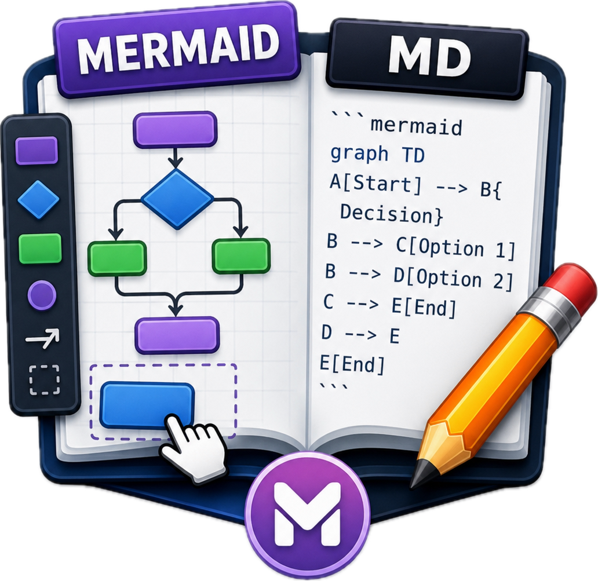
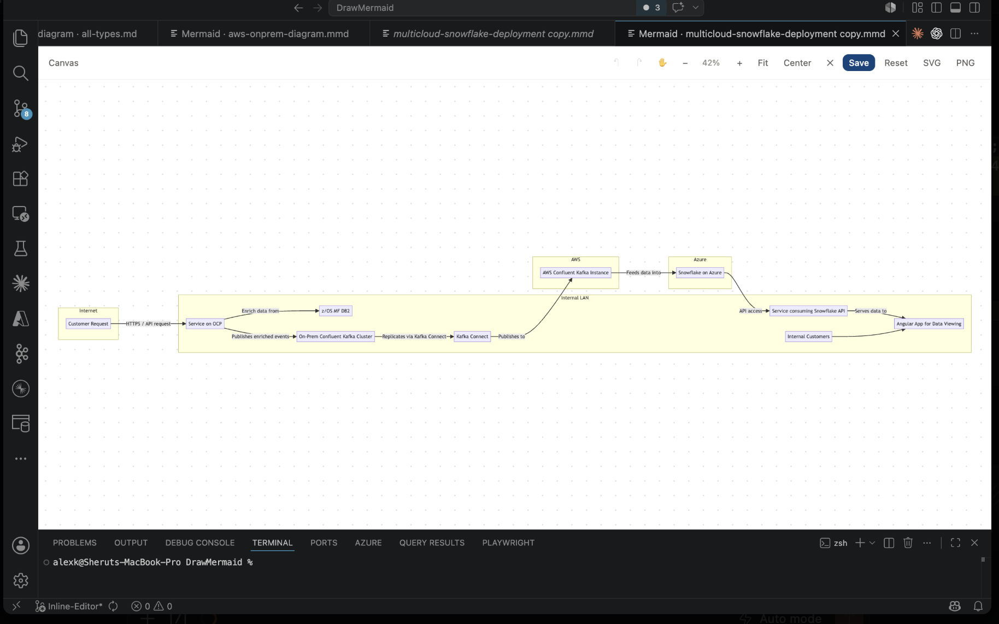
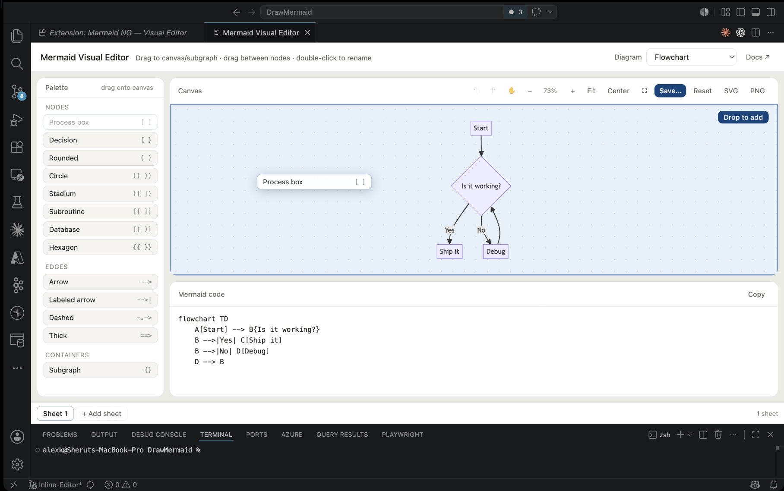
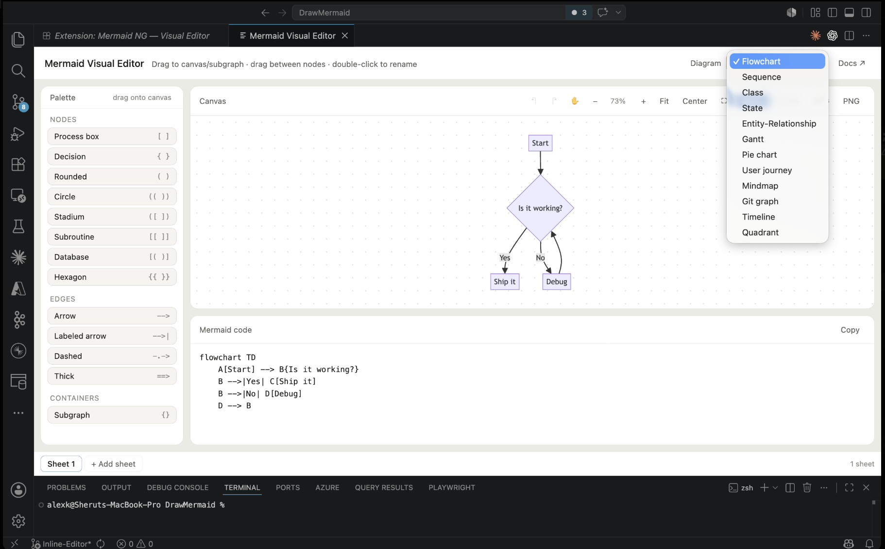
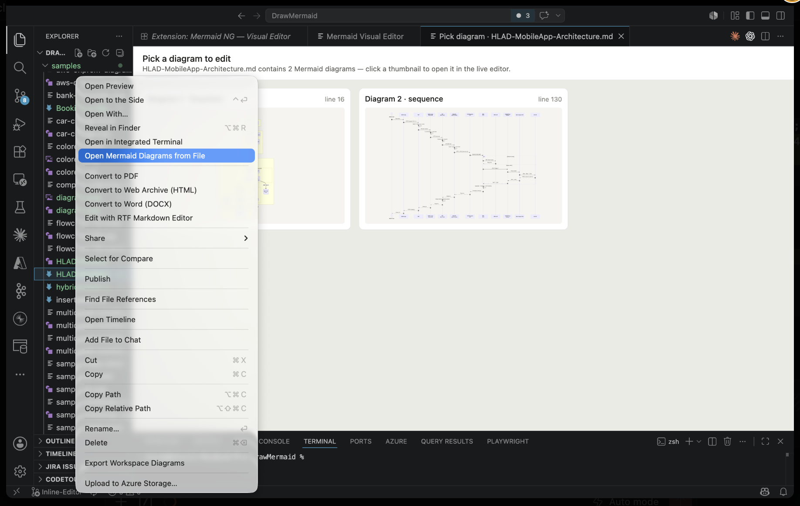
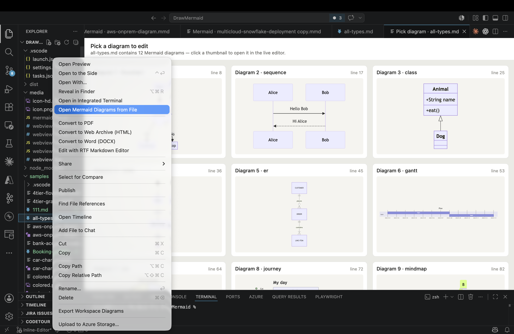
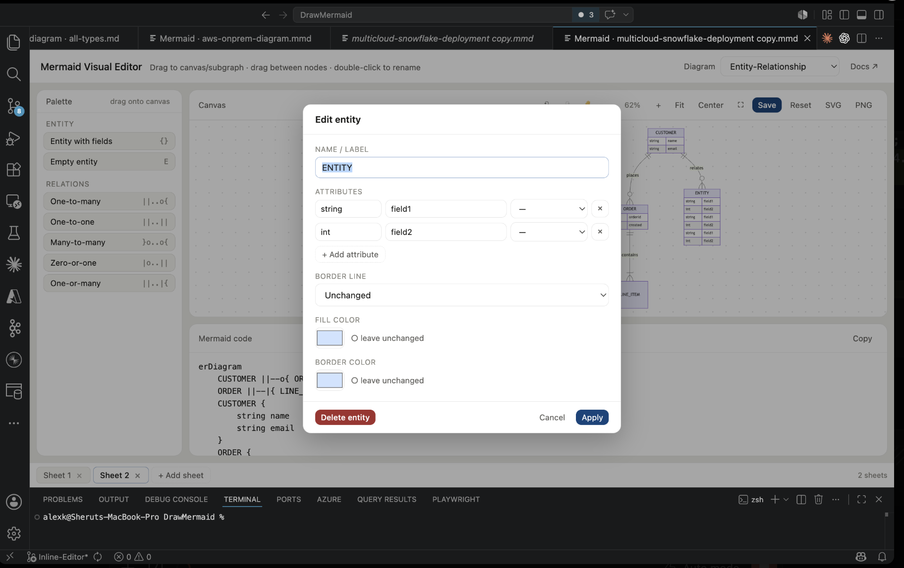

# Mermaid NG — Visual Editor



**WYSIWYG, drag-and-drop visual editor for AI-friendly Mermaid diagrams** — *what you see is what you get*. Built for architects and developers who want to *see* their flowcharts, sequence diagrams, class / ER / state models, gantt charts and mindmaps while building them — and round-trip them into the same `.md` or `.mmd` files they live in.

- 👁️ **WYSIWYG** — canvas changes update the Mermaid source in real time, and vice versa.
- 🌐 **Fully offline · no telemetry** — Mermaid 11.15.0 is bundled, zero network calls at runtime.
- 📑 Multi-sheet (draw.io style) — every ```` ```mermaid ```` block in a markdown file becomes a tab.
- 💾 Save back rewrites only the diagram blocks; surrounding prose is preserved.
- 🖼️ SVG / PNG export with sensible default filenames.
- ↶ Full undo / redo, palette drag, click-to-connect, double-click-to-edit, hover-to-delete.
- 🧱 Reads both `\`\`\`mermaid` fenced blocks and Azure DevOps Wiki `::: mermaid ... :::` containers.

A [NGPowerToys](https://github.com/NextGenPowerToys) extension.

🌐 **Project site:** <https://nextgenpowertoys.github.io/mermaid-visual-editor/>
📝 **Changelog:** [CHANGELOG.md](CHANGELOG.md) · **Current release:** 2.2.0

## Screenshots



| | |
| --- | --- |
|  |  |
|  |  |
|  | |

More on the [project site](https://nextgenpowertoys.github.io/mermaid-visual-editor/#screenshots).

## Repository layout

```text
mermaid-visual-editor/
├── vscode-extension/           the VSCode extension (this is what users install)
│   ├── package.json
│   ├── extension.js            host: webview, picker, save-back, exports
│   ├── README.md               extension docs — full feature list & usage
│   └── media/
│       ├── mermaid-editor.html the self-contained editor (Mermaid 11.15.0 bundled)
│       ├── icon.png            marketplace icon (256×256)
│       └── icon-hd.png         hi-res hero image for the README
├── LICENSE                     MIT
└── THIRD-PARTY-LICENSES        Mermaid MIT notice
```

## Install

The fastest path is the marketplace, but you can also install the `.vsix` directly:

```sh
cd vscode-extension
npm i -g @vscode/vsce
vsce package --allow-missing-repository
code --install-extension mermaid-visual-editor-2.2.0.vsix
```

Or open `vscode-extension/` in VSCode and press `F5` to launch an extension dev host.

See [vscode-extension/README.md](vscode-extension/README.md) for the full feature list, command reference, and usage instructions.

## License

This project's source code is licensed under the MIT License — see [LICENSE](LICENSE).

## Third-party

This project bundles [Mermaid](https://github.com/mermaid-js/mermaid) (v11.15.0), © 2014–2022 Knut Sveidqvist, also under the MIT License. Full text in [THIRD-PARTY-LICENSES](THIRD-PARTY-LICENSES); a copy is also embedded as an HTML comment inside [vscode-extension/media/mermaid-editor.html](vscode-extension/media/mermaid-editor.html) so the editor file remains compliant when distributed standalone.
