# Mermaid NG — All Supported Diagrams

A single-file gallery of every diagram family Mermaid NG renders. Open it
in the extension (right-click → **Mermaid NG: Open Mermaid Diagrams from
File**) — each block below becomes its own sheet in the multi-sheet picker.

## 1. Flowchart

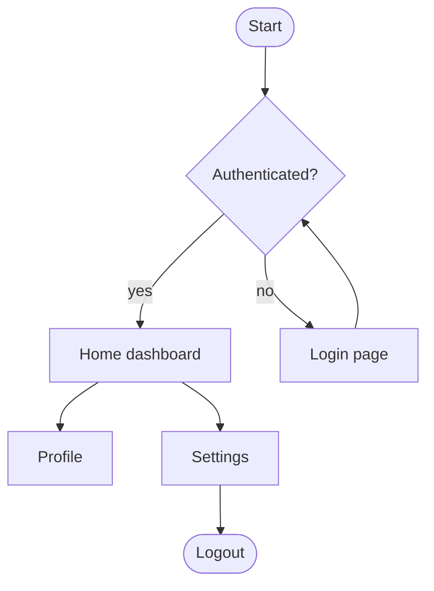

## 2. Sequence diagram

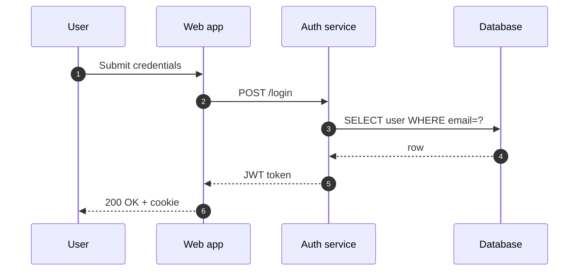

## 3. Class diagram

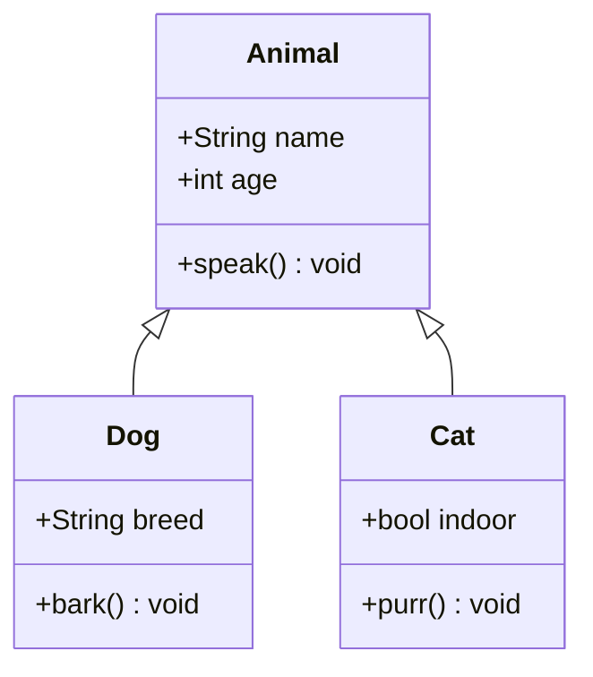

## 4. State diagram

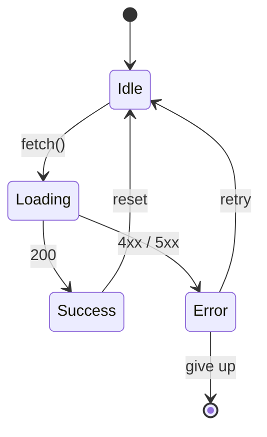

## 5. Entity-relationship diagram

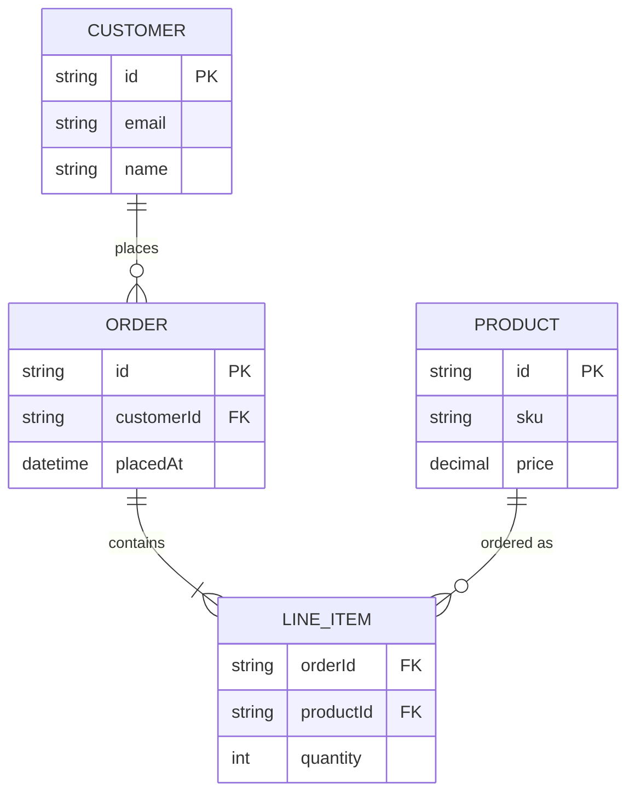

## 6. Gantt chart

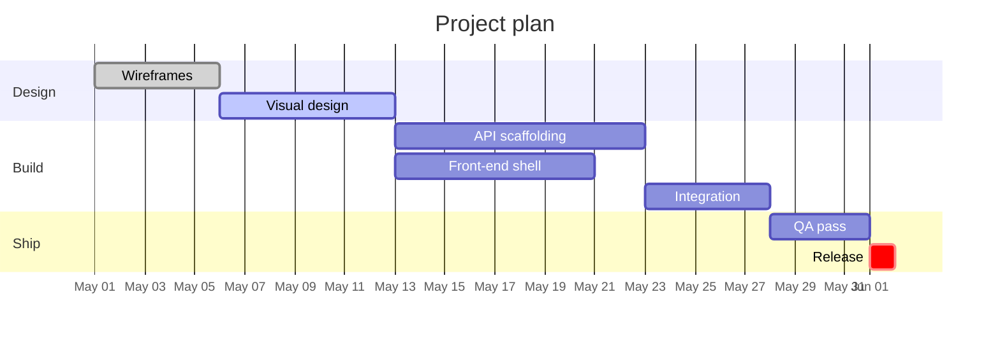

## 7. Pie chart

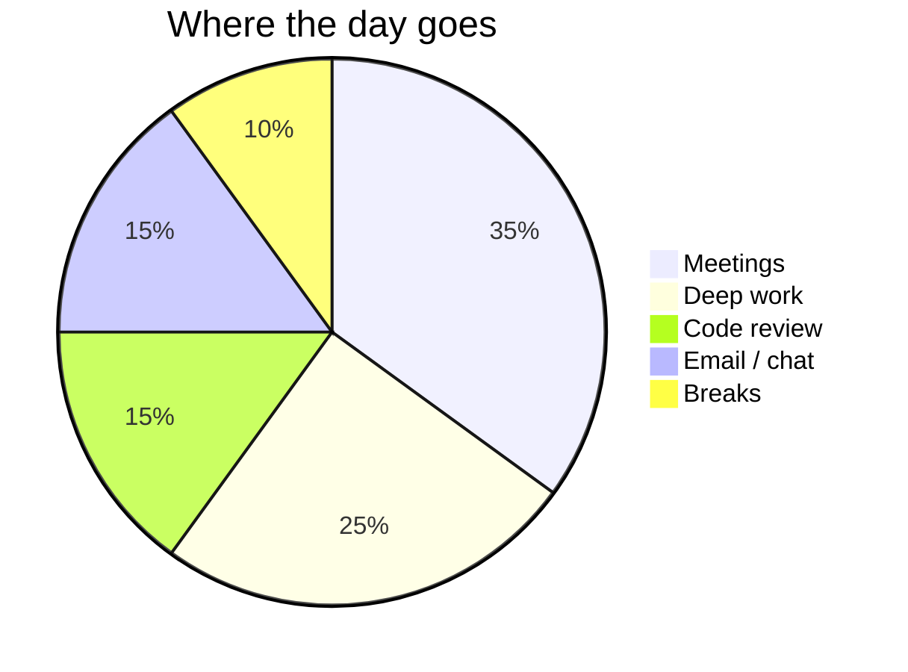

## 8. User journey

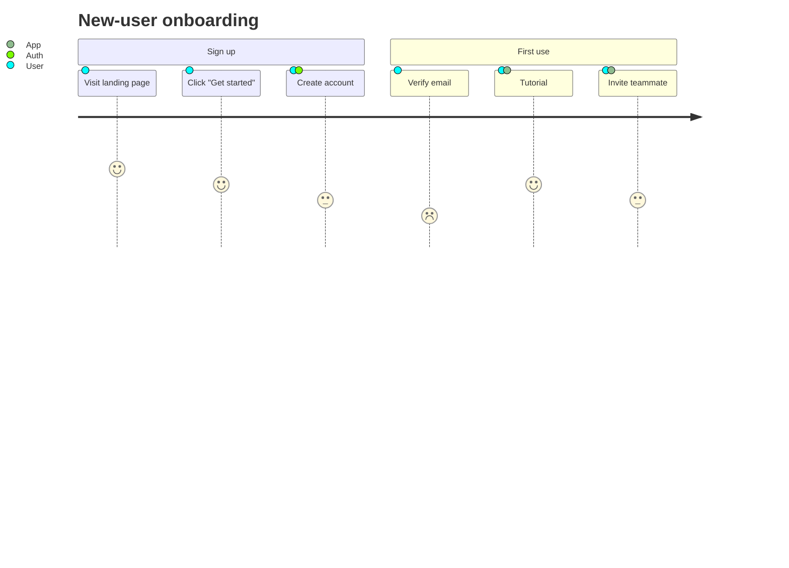

## 9. Mindmap

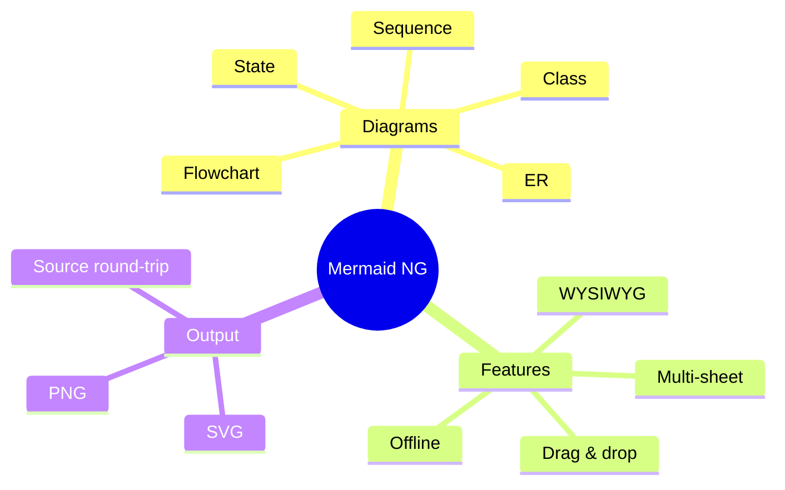

## 10. Gitgraph

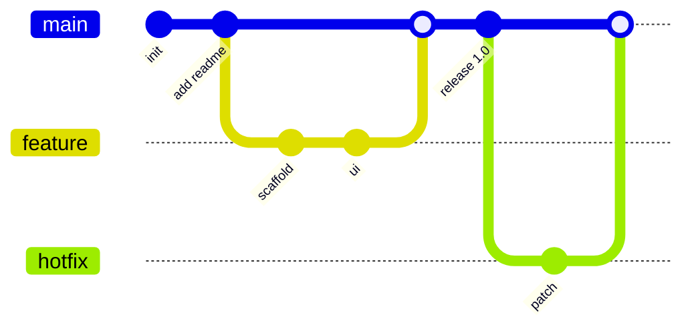

## 11. Timeline

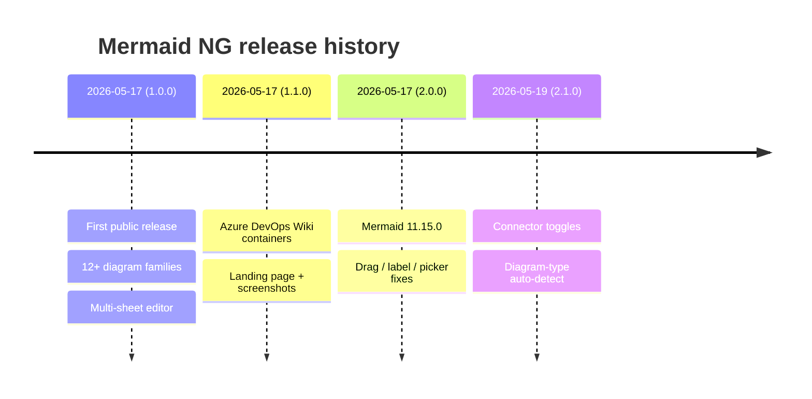

## 12. Quadrant chart

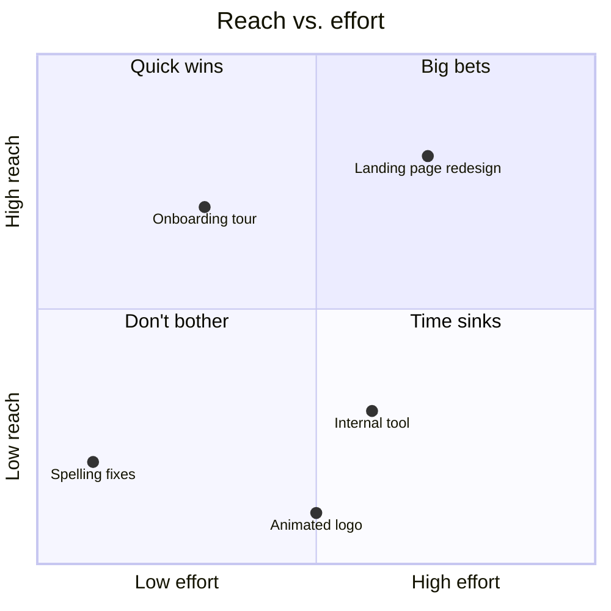
